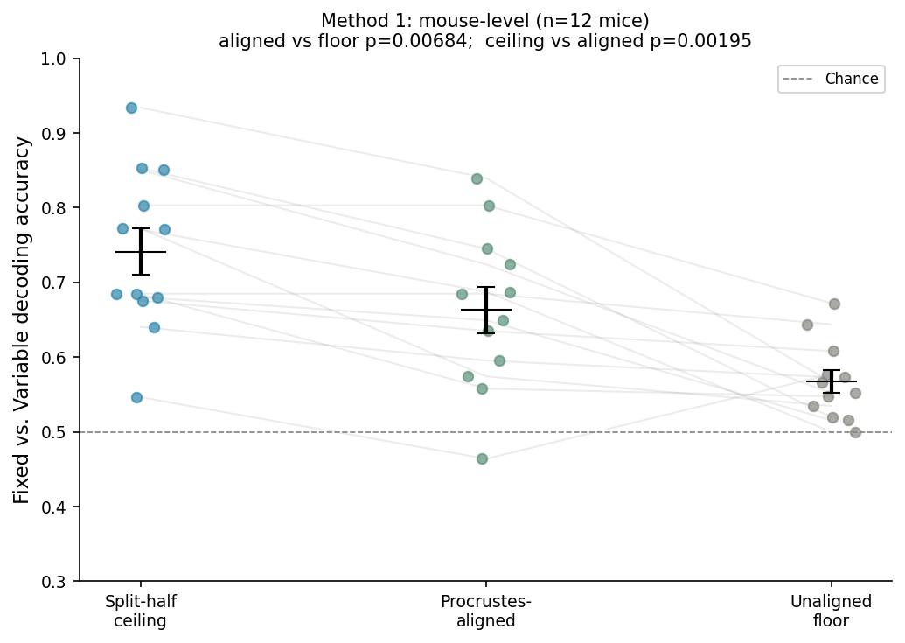
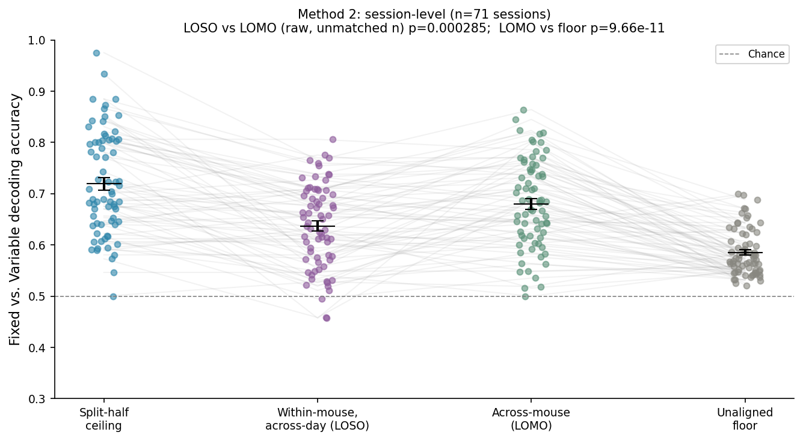
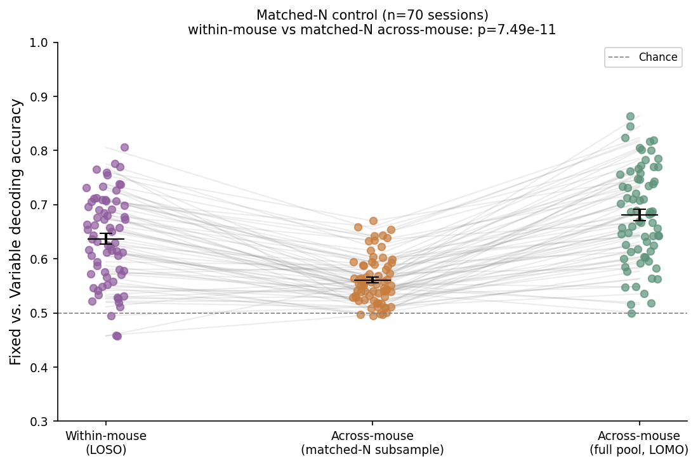
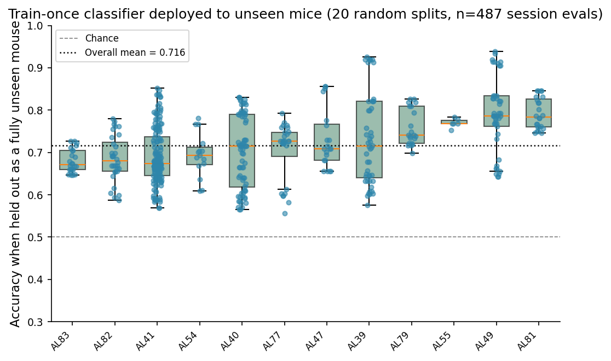

# Cross-Mouse Generalization of Distributional Reward Coding in the Striatum

## Introduction

Standard reinforcement learning (RL) algorithms learn to predict a single number for each state or action: the expected (mean) future reward, or "value" (Sutton & Barto, 2018). But an expected reward is really just a summary of an entire probability distribution of possible outcomes — two options with identical means can still differ substantially in their variance, skew, or other higher-order moments. *Distributional* RL algorithms instead learn to predict the full distribution of returns, and this richer learning target has been shown to substantially improve performance in artificial agents, for example enabling deep RL systems to achieve human-level or superhuman play across a wide range of Atari games (Bellemare, Dabney, & Munos, 2017). Given these gains in artificial systems, it is natural to ask whether the brain, too, might represent reward distributions rather than only their means — and there is already some evidence that it does: the diversity of reward prediction error signals across dopamine neurons in the mouse midbrain has been shown to resemble the signature of a distributional RL algorithm, in which different neurons are optimistically or pessimistically tuned to different quantiles of the reward distribution (Dabney et al., 2020).

If reward distributions really are represented in the brain, a natural next question is *how* — specifically, whether the geometric or population-level format used to encode a given distributional feature (such as the distinction between a fixed vs. a variable reward) is common across individuals, or whether each brain implements this code in its own idiosyncratic way. A precedent for this kind of question comes from human cognitive neuroscience, where "hyperalignment" methods have shown that idiosyncratic, subject-specific patterns of fMRI activity in ventral temporal cortex can be mapped into a common, high-dimensional representational space shared across individuals — a shared space that in turn affords meaningful across-subject decoding and prediction (Haxby et al., 2011). This raises the analogous question for reward coding: is there a common representational geometry, across individual brains, for a specific distributional feature of reward — and if so, can data from one individual help predict how a different, held-out individual represents that feature?

Lowet et al. (2025) provide a rich single-neuron and population-level dataset for probing exactly this question in the mouse striatum. They showed that striatal neural populations represent not just the mean of an expected reward but also its variance: Fixed (deterministic, 4 μl) and Variable (50/50% chance of 2 or 6 μl) reward-predicting odours evoked systematically different population-level activity patterns despite having identical mean value (Lowet et al., 2025, *Nature*, 639, 717–726). This "distributional" code for Fixed vs. Variable reward was shown to be robust within individual mice — but it remains unclear whether the specific *geometric* format in which this distinction is embedded in neural population activity is idiosyncratic to each animal, or is instead a shared, canonical structure across animals.

We adapt cross-subject representational-alignment methods (detailed in Methods) to the Lowet et al. striatal dataset to address this question directly: is there a shared representational geometry for encoding Fixed-vs-Variable reward identity across mice, such that aligning one mouse's neural trajectories to those of others confers above-chance information about how a held-out mouse encodes this distinction?

## Methods

**Data.** Neuropixels recordings of striatal single units from 12 mice performing the classical-conditioning task described in Lowet et al. (2025), comprising 71 qualifying sessions and 13,997 total recorded neurons (Lowet et al., 2025). For each session/mouse, trial-averaged, z-scored firing rates were computed for six trace types (two Fixed, two Variable odours, plus two Nothing) across four 1-s analysis periods (baseline, odour, early trace, late trace); only sessions with ≥30 simultaneously recorded neurons and ≥5 trials per trace type were retained.

**Cross-subject alignment procedure.** The alignment approach used here is adapted from Chen, Manning, and van der Meer (2021), who asked whether the relationship between left- and right-arm trajectories on a hippocampal T-maze task is preserved across rats, despite each animal having its own idiosyncratic place-cell code. Using hyperalignment/Procrustes-based methods originally developed for human fMRI hyperalignment (Haxby et al., 2011), they found that a transformation learned from one rat's data could be used to predict a different rat's neural activity on a held-out condition significantly above chance (Chen et al., 2021, *Current Biology*, 31, 4293–4304). We adapt their "Hypertransform analysis procedure" as follows.

**Dimensionality reduction and alignment.** Condition-averaged trajectories for each session/mouse were first projected into an 8-dimensional PCA space (since neuron counts differ across sessions and mice). Generalized Procrustes Analysis (GPA) was then used to iteratively find, for a set of "training" trajectories, the rotation/reflection/translation (no scaling) transformations that minimize the summed Euclidean distance to a shared template; a held-out trajectory was aligned to this template via a single Procrustes fit ("Hyperalignment" and "Hypertransform" steps of Chen et al., STAR Methods).

**Decoding.** Trial-level features were obtained by projecting single-trial late-trace responses (Fixed vs. Variable trials only) into the aligned space, and a logistic regression classifier was trained to distinguish Fixed from Variable trials. Three conditions were compared:
- *Split-half ceiling*: classifier trained and tested on random halves of a single mouse's own trials (no cross-subject information; equivalent to Chen et al.'s "split-half prediction").
- *Aligned (leave-one-mouse-out, LOMO)*: classifier trained on the Procrustes-aligned trajectories of all other mice, tested on the held-out mouse's aligned trials.
- *Unaligned floor*: identical decoding procedure but using only the raw PCA projection, omitting the Procrustes/hyperalignment step (Chen et al.'s "PCA only" control).

This was run at two levels of granularity: (1) **mouse-level**, using each mouse's single largest qualifying session (n = 12 mice), and (2) **session-level**, using every qualifying session individually (n = 71 sessions), with alignment legs for within-mouse-across-day (leave-one-session-out, LOSO) and across-mouse (LOMO) holdouts. Because LOMO trains on many more sessions than LOSO, a matched-N control repeated the LOMO leg while subsampling the training pool to match each session's LOSO training-set size. Finally, a train-once/deploy-to-unseen-mice analysis fit a single GPA template and classifier on a random ~70% of mice and evaluated it, without further fitting, on every session of the fully held-out ~30% of mice, repeated over 20 random splits.

Group comparisons used two-sided Wilcoxon signed-rank tests. Two deviations from Chen et al. (2021) are noted: (1) here a classifier is trained on the aligned space to decode trial *condition* (Fixed vs. Variable), rather than using the source mouse's condition-transform to directly predict the target's held-out neural activity pattern; (2) 4 second-long analysis bins (vs. Chen et al.'s 48 within-trial 50-ms bins) were used, as the available data (`cue_resps`) is pre-binned this way — a coarser temporal representation that should make cross-mouse alignment more, not less, difficult, and so is expected to yield conservative estimates.

## Results

**Mouse-level (n = 12 mice).** Aligned cross-mouse decoding of Fixed vs. Variable trials (mean accuracy = 0.663, SEM = 0.031) was significantly above the unaligned floor (0.567, SEM = 0.015; Wilcoxon W = 6.00, p = 0.0068), and significantly below the within-mouse split-half ceiling (0.741, SEM = 0.031; W = 0.00, p = 0.0020). All 12 mice showed aligned accuracy above their own unaligned floor (individual mouse values ranged from 0.464–0.840 for aligned decoding vs. 0.500–0.672 for the floor). This pattern is shown in Figure 1.

*Figure 1. Mouse-level decoding accuracy (n = 12 mice). Split-half ceiling: 0.741 ± 0.031; aligned: 0.663 ± 0.031; unaligned floor: 0.567 ± 0.015. Aligned vs. floor: p = 0.0068; ceiling vs. aligned: p = 0.0020.*

**Session-level (n = 71 sessions).** The pattern replicated at finer granularity: split-half ceiling = 0.719 (SEM 0.012), within-mouse across-day (LOSO) alignment = 0.637 (SEM 0.010, n = 70), across-mouse (LOMO) alignment = 0.680 (SEM 0.010), unaligned floor = 0.585 (SEM 0.005). Across-mouse alignment outperformed the unaligned floor (W = 125.00, p = 9.7 × 10⁻¹¹, n = 71). The raw comparison of across-mouse (LOMO) vs. within-mouse (LOSO) alignment favored LOMO (W = 537.50, p = 2.9 × 10⁻⁴, n = 70), but this comparison is confounded: LOMO trains on ~60+ sessions from other mice, while LOSO trains on only 1–4 sessions from the same mouse. This is shown in Figure 2.

*Figure 2. Session-level decoding accuracy (n = 71 sessions). Split-half ceiling: 0.719 ± 0.012; LOSO: 0.637 ± 0.010; LOMO: 0.680 ± 0.010; unaligned floor: 0.585 ± 0.005. LOSO vs. LOMO (raw, unmatched n): p = 2.9 × 10⁻⁴; LOMO vs. floor: p = 9.7 × 10⁻¹¹.*

**Matched-N control.** After subsampling the across-mouse training pool to match each session's own LOSO training-set size, within-mouse alignment (mean = 0.637) outperformed matched-N across-mouse alignment (mean = 0.561, vs. 0.681 for the unmatched, full-pool LOMO reference; W = 130.00, p = 7.5 × 10⁻¹¹, n = 70). This indicates that the raw session-level LOMO > LOSO effect was largely a training-set-size artifact, and that once training-set size is equalized, staying within-animal is in fact more informative than crossing animals — consistent with each animal's code containing session-idiosyncratic structure beyond what is shared across animals. This control is shown in Figure 3.

*Figure 3. Matched-N control (n = 70 sessions). Within-mouse (LOSO): 0.637; matched-N across-mouse: 0.561; full-pool across-mouse (LOMO, reference): 0.681. Within-mouse vs. matched-N across-mouse: p = 7.5 × 10⁻¹¹.*

**Train-once, deploy-to-unseen-mice.** A classifier and GPA template fit once on a random ~70% of mice and then applied, without any further fitting, to every session of the fully unseen ~30% of mice achieved a mean accuracy of 0.716 (SEM = 0.004) across 487 session evaluations pooled over 20 random splits, with all 12 mice individually averaging above chance (per-mouse means ranged from 0.679 [AL83] to 0.792 [AL81]) when they were the held-out, unseen mouse. Per-mouse means and spread across splits are shown in Figure 4.

*Figure 4. Train-once, deploy-to-unseen-mice accuracy by held-out mouse (20 random 70/30 splits, n = 487 session evaluations). Overall mean: 0.716 ± 0.004. Per-mouse means ranged from 0.679 (AL83) to 0.792 (AL81); e.g., AL49: 0.791 ± 0.013 (n=45 splits), AL54: 0.694 ± 0.013 (n=15 splits).*

## Conclusion

Across three complementary analyses — mouse-level leave-one-out, session-level leave-one-mouse-out, and a fixed train-once classifier deployed to fully unseen mice — Procrustes-aligned cross-mouse decoding of Fixed vs. Variable reward identity consistently and significantly exceeded an unaligned, PCA-only floor, while remaining significantly below the within-mouse (split-half) ceiling. This pattern mirrors the finding of Chen et al. (2021) in hippocampal place-cell data, where alignment closes part, but not all, of the gap between chance-level cross-subject transfer and the best achievable within-subject performance. The matched-N control adds an important qualification: once training-set size is equalized, within-animal information remains more predictive than across-animal information, indicating that alignment does not simply substitute for having more of an animal's own data. 

Together, these results suggest that the striatal distributional (Fixed-vs-Variable) code has a partially shared, transferable geometric structure across mice, superimposed on session- and animal-idiosyncratic structure that alignment does not fully recover. In other words, the representational geometry for reward variance in the striatum appears to be neither fully idiosyncratic nor fully canonical across animals — a finding that motivates further work, such as a subregion- or D1/D2-resolved version of this alignment, and an investigation into what drives the substantial across-mouse variability in decoding accuracy seen in the deploy-to-unseen-mice analysis, to better characterize the shared versus private components of this code.

## References

- Sutton, R. S., & Barto, A. G. (2018). *Reinforcement Learning: An Introduction* (2nd ed.). MIT Press.
- Bellemare, M. G., Dabney, W., & Munos, R. (2017). A distributional perspective on reinforcement learning. In *Proceedings of the 34th International Conference on Machine Learning* (pp. 449–458). PMLR.
- Dabney, W., Kurth-Nelson, Z., Uchida, N., Starkweather, C. K., Hassabis, D., Munos, R., & Botvinick, M. (2020). A distributional code for value in dopamine-based reinforcement learning. *Nature*, 577, 671–675. https://doi.org/10.1038/s41586-019-1924-6
- Haxby, J. V., Guntupalli, J. S., Connolly, A. C., Halchenko, Y. O., Conroy, B. R., Gobbini, M. I., Hanke, M., & Ramadge, P. J. (2011). A common, high-dimensional model of the representational space in human ventral temporal cortex. *Neuron*, 72, 404–416. https://doi.org/10.1016/j.neuron.2011.08.026
- Lowet, A. S., Zheng, Q., Meng, M., Matias, S., Drugowitsch, J., & Uchida, N. (2025). An opponent striatal circuit for distributional reinforcement learning. *Nature*, 639, 717–726. https://doi.org/10.1038/s41586-024-08488-5
- Chen, H.-T., Manning, J. R., & van der Meer, M. A. A. (2021). Between-subject prediction reveals a shared representational geometry in the rodent hippocampus. *Current Biology*, 31, 4293–4304. https://doi.org/10.1016/j.cub.2021.07.061